# Pragmata Solar Power Plant Collectible Locations

*2026-04-16T13:07:27+00:00 · PowerPyx*

Source: [https://www.powerpyx.com/pragmata-solar-power-plant-collectible-locations/](https://www.powerpyx.com/pragmata-solar-power-plant-collectible-locations/)

Solar Power Plant is the 1st sector in Pragmata and contains 15 Collectible Locations. This walkthrough will guide you to all the collectibles in Solar Power Plant region. Everything that’s needed for trophies and 100% completion is included. Nothing is missable, everything can be collected after the story in Unknown Signal Mode.

- Mini Cabins: 3
- Escape Hatches: 3
- Safe Boxes: 3
- Pure Lunum: 1
- REM: 2
- Mods: 1
- Storage Expander: 1
- Cartridge Holder: 1

On the first visit to some areas, you are still missing the story-related skills needed to reach collectibles. If you can’t reach something, grab it after the story in Unknown Signal (Cleanup Mode).

**Collectibles Overview:**

## Solar Power Plant – Generator Entrance

Storage Expander 1 **[REQUIRES BACKTRACKING – Lim Eraser]** – Only obtainable after getting the Lim Eraser (automatic story unlock in Mass Production Array 05). Erase the blockade in the door and find it there. The backtracking collectibles will be pointed out again later in the guide after getting their required ability, so don’t worry about this for now.

[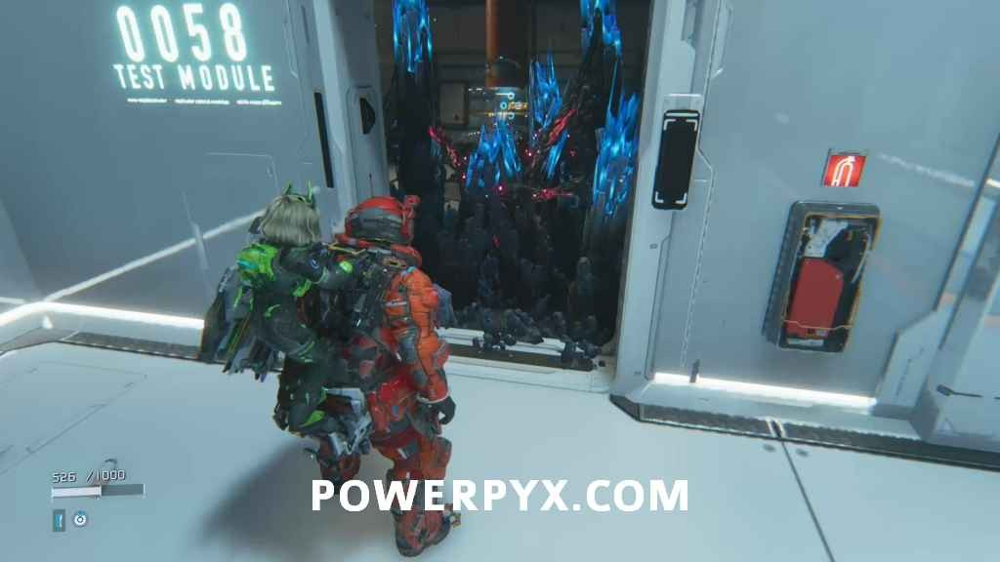](https://www.powerpyx.com/wp-content/uploads/Pragmata-Solar-Power-Plant-1.jpg)

## Solar Power Plant – Power Distribution Center

Escape Hatch 1 – You will run straight into it on your story progression path, unmissable.

[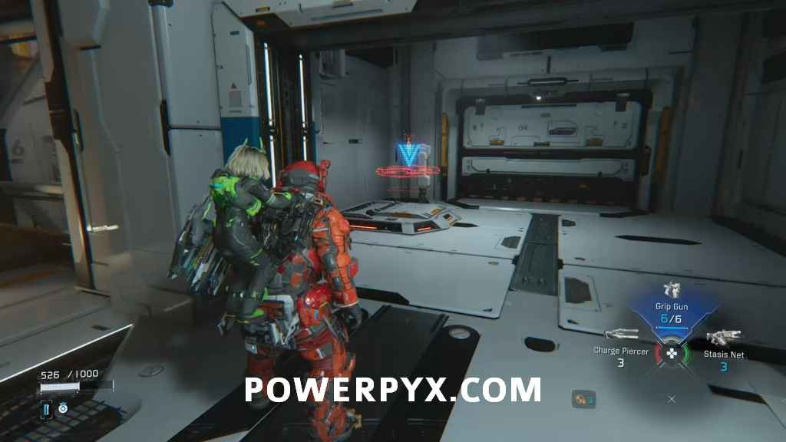](https://www.powerpyx.com/wp-content/uploads/Pragmata-Solar-Power-Plant-2.jpg)

Safe Box 1 – In the area where you have to unlock 5 locks. From the big door with 5 locks, drop down the left side, go up the elevator, at the top go to the right corner and drop down to an area with a dark floor. There behind some movable platforms you can find the box.

[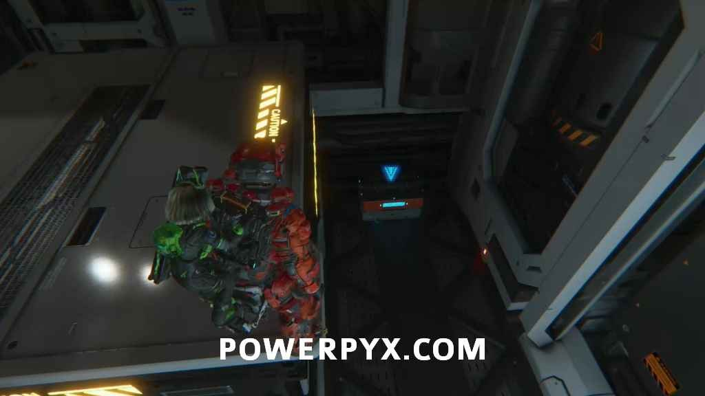](https://www.powerpyx.com/wp-content/uploads/Pragmata-Solar-Power-Plant-3.jpg)

Mini Cabin 1 – In the same general area, go back to the door with 5 locks, drop down left of it, go up the elevator, but this time go to the left corner. Enter the tunnel next to one of the door locks. The tunnel will get locked off until you defeat a big and small enemy inside it. Exit the tunnel on the other side and find it on your right. Must shoot the Mini Cabins to destroy them.

[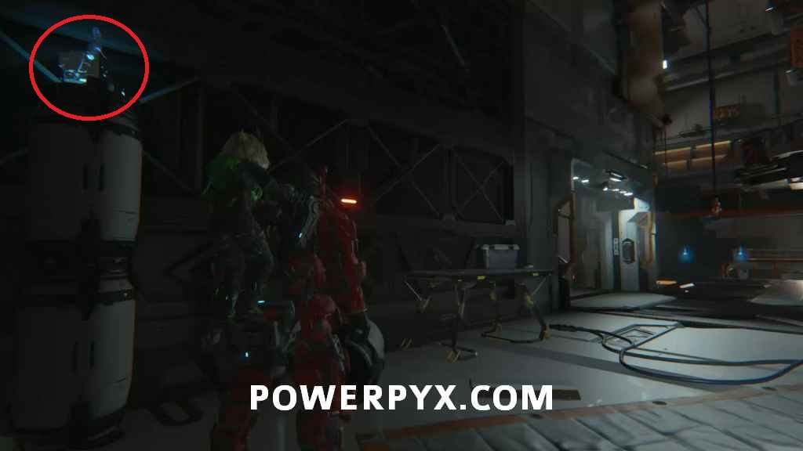](https://www.powerpyx.com/wp-content/uploads/Pragmata-Solar-Power-Plant-4-1.jpg)

Pure Lunum 1 + Safe Box 2 **[REQUIRES BACKTRACKING – Lim Eraser]**– In the same area but you will need the Lim Eraser for it. Once you have it come back to this exact place (automatic story unlock in Mass Production Array 05). After erasing the blockade follow the path into a battle arena and once you defeat all the enemies loot the crates here. If it’s your first visit to the area you can’t get it yet, the backtracking collectibles will be pointed out again in the guide later after unlocking the Lim Eraser.

[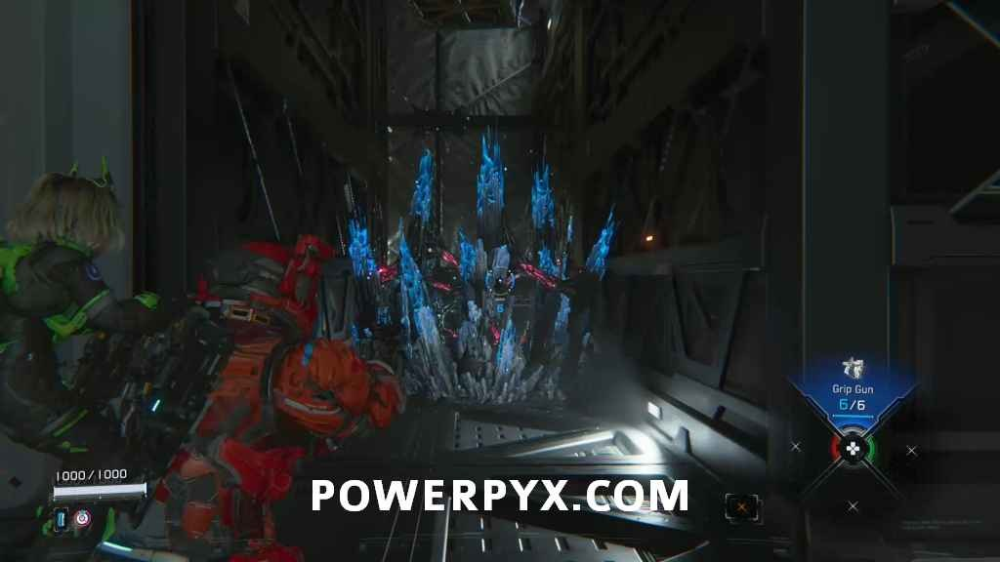](https://www.powerpyx.com/wp-content/uploads/Pragmata-Solar-Power-Plant-5.jpg)

Safe Box 3 – Go back to the 5-lock door, drop down the left, go up elevator, at the top go straight forward and drop down to the lower floor (basically to the right of the 5-lock door). At the bottom, defeat the enemies, go up the stairs and follow this path to the dead end where the Safe Box awaits.

[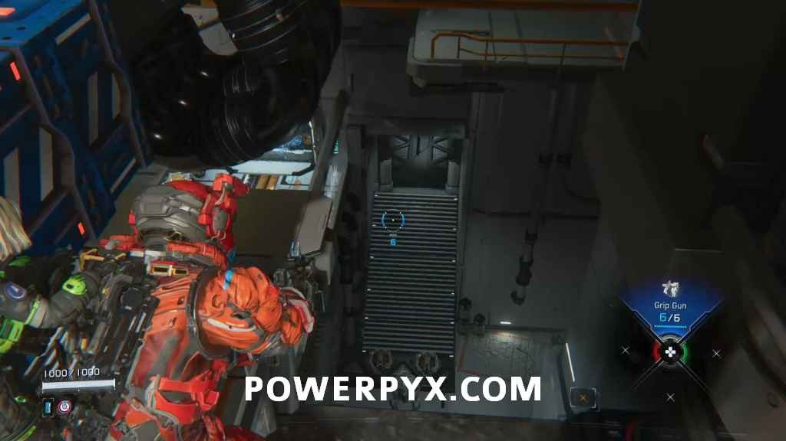](https://www.powerpyx.com/wp-content/uploads/Pragmata-Solar-Power-Plant-6.jpg)

## Solar Power Plant – The Concourse

REM 1 (Globe) – Obtained automatically after the cutscene with Diana and the globe.

Mini Cabin 2 – In the same room you can find it in the empty bunk cabin with the net in front of it.

[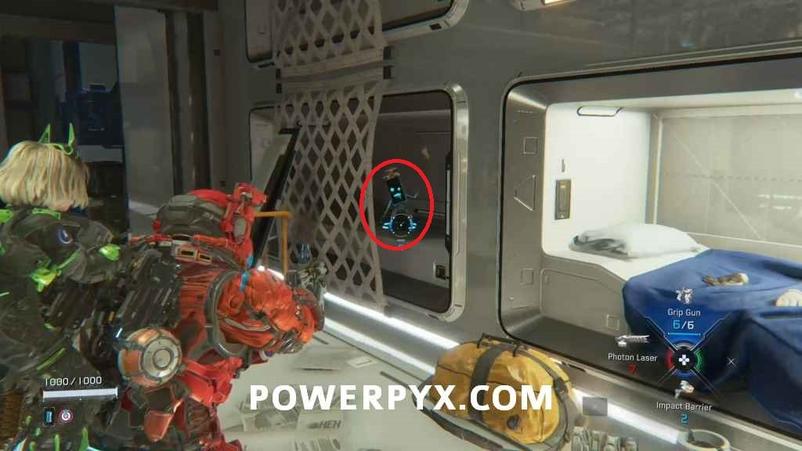](https://www.powerpyx.com/wp-content/uploads/Pragmata-Solar-Power-Plant-8.jpg)

Escape Hatch 2 – You will run straight into it shortly after.

[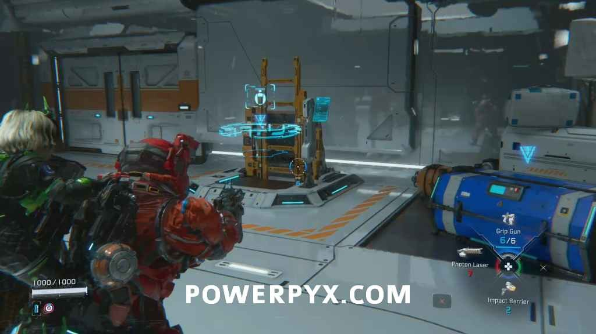](https://www.powerpyx.com/wp-content/uploads/Pragmata-Solar-Power-Plant-9.jpg)

Mod 1 (Hardened Suit) – Can be found in the box next to the Escape Hatch.

[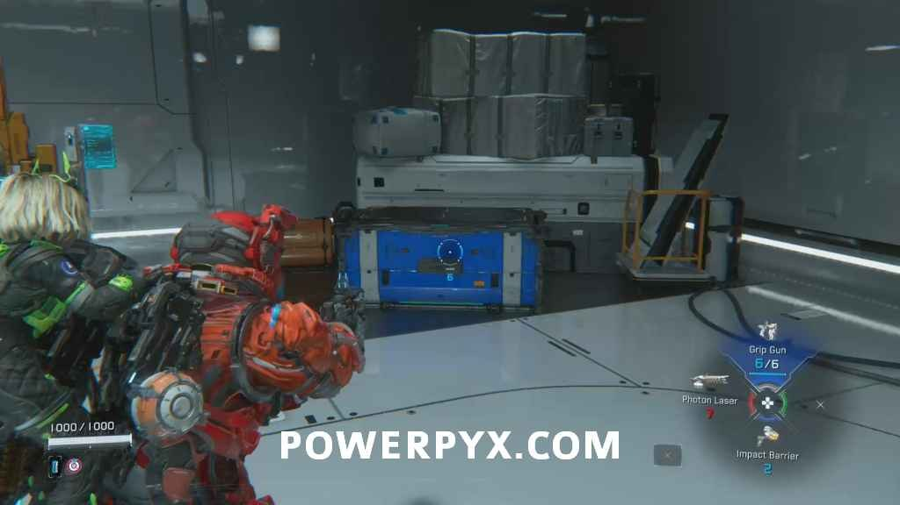](https://www.powerpyx.com/wp-content/uploads/Pragmata-Solar-Power-Plant-10.jpg)

Cartridge Holder 1 – In the room to the left of the Escape Hatch.

[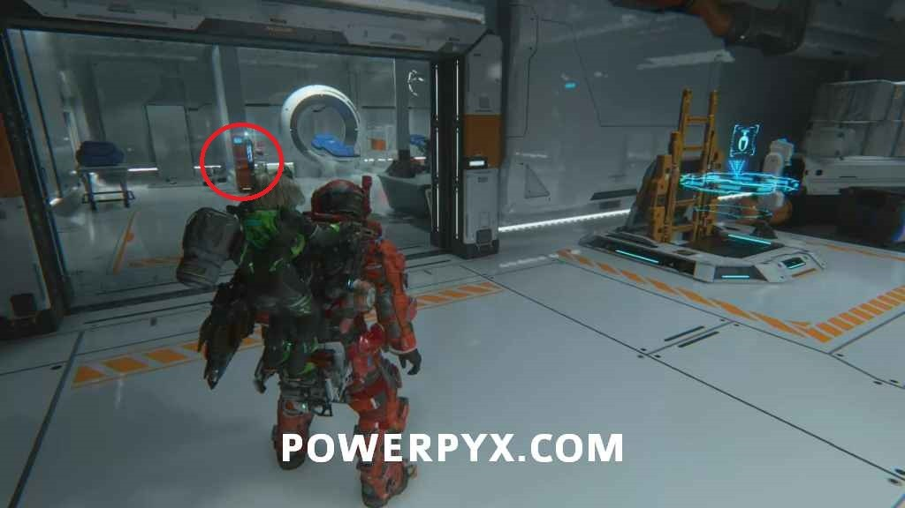](https://www.powerpyx.com/wp-content/uploads/Pragmata-Solar-Power-Plant-11.jpg)

Mini Cabin 3 – After obtaining the first decode and defeating the enemy you will find it on a vent next to the zipline that takes you up. It’s on the wall vent halfway up the zipline.

[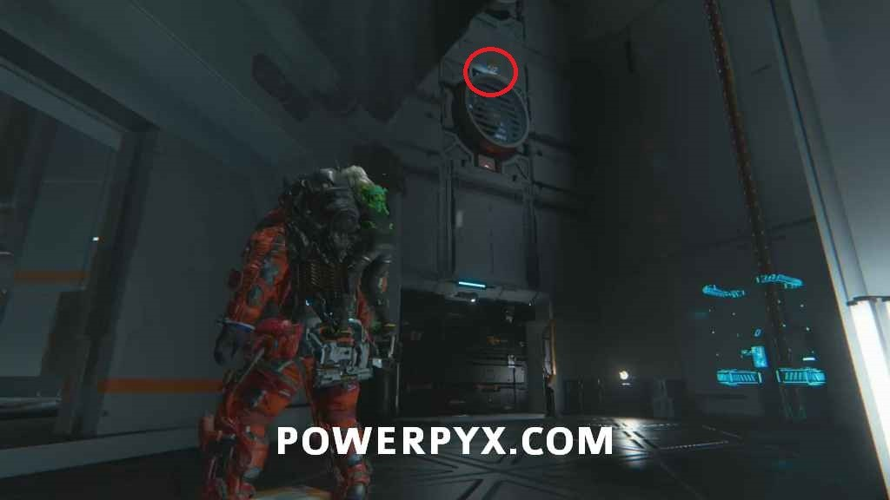](https://www.powerpyx.com/wp-content/uploads/Pragmata-Solar-Power-Plant-12.jpg)

REM 2 (Crayons) – Also up the zipline is a Holo-Wall you can interact with (press  while standing in front of it), behind it you will find the REM.

[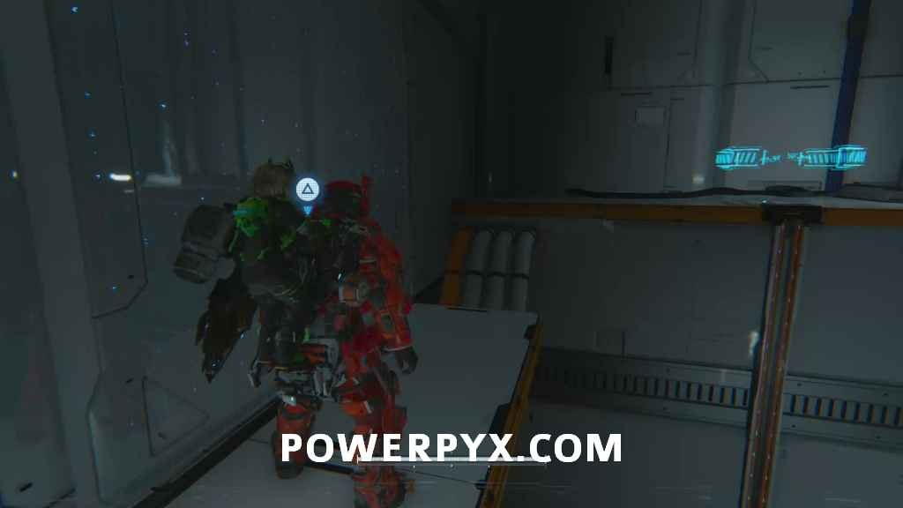](https://www.powerpyx.com/wp-content/uploads/Pragmata-Solar-Power-Plant-13.jpg)

Escape Hatch 3 – You can find it at the top of the elevator, in the area where you fight the first boss. You have to return here again after the boss for it to appear since you will get transported to the Shelter automatically shortly after the boss.

[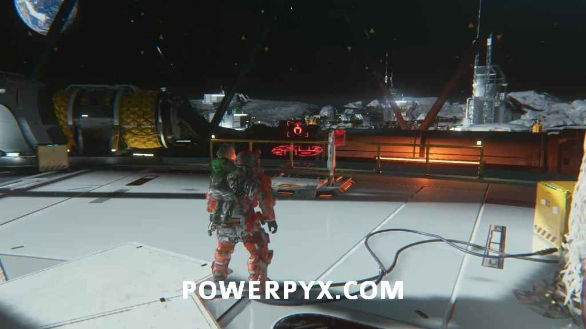](https://www.powerpyx.com/wp-content/uploads/Pragmata-Solar-Power-Plant-14.jpg)

This covers all the collectibles in **Solar Power Plant**.

NEXT: [**Mass Production Array (MPA)**](https://www.powerpyx.com/pragmata-mass-production-array-collectible-locations/)
